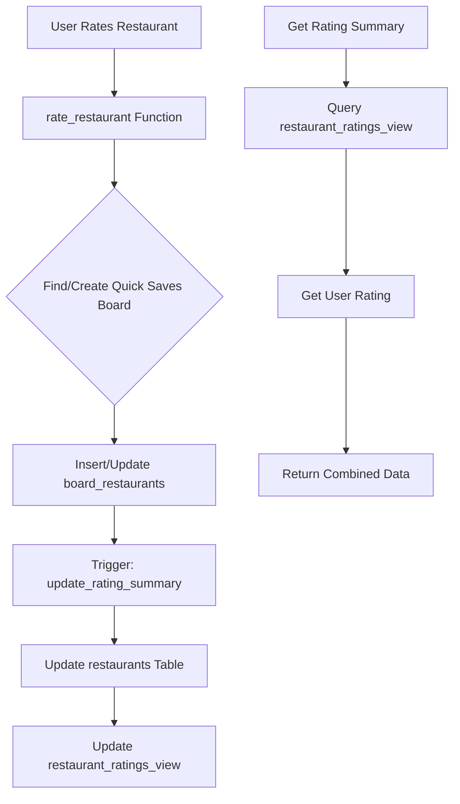

# Traffic Light Rating System: Research & Implementation Guide

## Executive Summary

Troodie's traffic light rating system represents a fundamental shift from traditional 5-star ratings to a more intuitive, engaging, and decision-focused rating mechanism. This document analyzes the current implementation and provides recommendations for optimizing the system to differentiate Troodie from platforms like Yelp while maintaining data quality and user engagement.

## Table of Contents

1. [Current State Analysis](#current-state-analysis)
2. [Research: Why Traffic Light Ratings](#research-why-traffic-light-ratings)
3. [Implementation Architecture](#implementation-architecture)
4. [Data Migration Strategy](#data-migration-strategy)
5. [Frontend Implementation](#frontend-implementation)
6. [Backend Optimization](#backend-optimization)
7. [Analytics & Insights](#analytics--insights)
8. [Future Enhancements](#future-enhancements)

---

## Current State Analysis

### Database Design

The current implementation leverages a sophisticated architecture:

1. **Core Tables**:
   - `restaurants`: Contains rating summary fields (`red_ratings_count`, `yellow_ratings_count`, `green_ratings_count`, `overall_rating`)
   - `board_restaurants`: Stores individual ratings via `traffic_light_rating` column
   - Uses board-based system where ratings are tied to saves

2. **Key Features**:
   - Automatic rating summary calculation via PostgreSQL triggers
   - User ratings tied to their "Quick Saves" board
   - Real-time rating updates using database functions
   - Rating percentages calculated in views for performance

### Current Limitations

1. **Yelp Data Integration**: 
   - Restaurants seeded with `google_rating` (1-5 scale)
   - No automatic conversion to traffic light system
   - Potential confusion with dual rating systems

2. **User Experience**:
   - Ratings require board association (extra complexity)
   - No anonymous rating support
   - Limited rating context (no review text)

---

## Research: Why Traffic Light Ratings

### Cognitive Psychology Benefits

1. **Decision Simplification**:
   - Binary decision tree: Good (Green) → Maybe (Yellow) → No (Red)
   - Reduces decision fatigue compared to 5-star granularity
   - Aligns with natural human categorization

2. **Visual Processing**:
   - Traffic light metaphor is universally understood
   - Color coding provides instant visual feedback
   - Reduces cognitive load for quick decisions

3. **Engagement Patterns**:
   - Users more likely to rate when options are simple
   - Reduces "analysis paralysis" of star ratings
   - Encourages more frequent engagement

### Market Differentiation

| Platform | Rating System | Pros | Cons |
|----------|--------------|------|------|
| Yelp | 5-star + reviews | Detailed feedback | Rating fatigue, fake reviews |
| Troodie | Traffic Light | Simple, authentic | Less granular |
| Google | 5-star | Familiar | No differentiation |
| Thumbs | Up/Down | Very simple | Too binary |

### Data Quality Advantages

1. **Reduced Gaming**: Harder to manipulate 3 options vs 5-star averages
2. **Clearer Signals**: Strong love/hate signals vs muddled 3-4 star ratings
3. **Authentic Feedback**: Users more honest with simple options

---

## Implementation Architecture

### Backend Architecture



### Database Schema Enhancements

```sql
-- Enhanced rating context table
CREATE TABLE rating_contexts (
    id UUID PRIMARY KEY DEFAULT gen_random_uuid(),
    board_restaurant_id UUID REFERENCES board_restaurants(id),
    occasion VARCHAR(50), -- 'date_night', 'business_lunch', etc.
    price_perception VARCHAR(20), -- 'worth_it', 'overpriced', 'great_value'
    would_return BOOLEAN,
    created_at TIMESTAMP WITH TIME ZONE DEFAULT NOW()
);

-- Rating trends for analytics
CREATE TABLE rating_trends (
    restaurant_id UUID REFERENCES restaurants(id),
    period_date DATE,
    period_type VARCHAR(20), -- 'daily', 'weekly', 'monthly'
    red_count INTEGER DEFAULT 0,
    yellow_count INTEGER DEFAULT 0,
    green_count INTEGER DEFAULT 0,
    sentiment_score DECIMAL(3,2), -- -1 to 1 scale
    PRIMARY KEY (restaurant_id, period_date, period_type)
);
```

---

## Data Migration Strategy

### Converting Yelp/Google Ratings

```sql
-- Conversion function for initial seeding
CREATE OR REPLACE FUNCTION convert_star_to_traffic_light(star_rating DECIMAL)
RETURNS VARCHAR AS $$
BEGIN
    IF star_rating >= 4.5 THEN
        RETURN 'green';
    ELSIF star_rating >= 3.5 THEN
        RETURN 'yellow';
    ELSIF star_rating IS NOT NULL THEN
        RETURN 'red';
    ELSE
        RETURN NULL;
    END IF;
END;
$$ LANGUAGE plpgsql;

-- Migration script for existing data
UPDATE restaurants 
SET overall_rating = convert_star_to_traffic_light(google_rating)
WHERE overall_rating = 'neutral' AND google_rating IS NOT NULL;
```

### Handling Dual Systems

1. **Display Logic**:
   ```typescript
   // Restaurant display priority
   const getDisplayRating = (restaurant: Restaurant) => {
     // Priority 1: Traffic light ratings if available
     if (restaurant.total_ratings_count > 0) {
       return {
         type: 'traffic_light',
         value: restaurant.overall_rating,
         count: restaurant.total_ratings_count
       }
     }
     
     // Priority 2: Converted Google rating
     if (restaurant.google_rating) {
       return {
         type: 'converted',
         value: convertStarToTrafficLight(restaurant.google_rating),
         count: restaurant.google_reviews_count,
         original: restaurant.google_rating
       }
     }
     
     return { type: 'none', value: 'neutral' }
   }
   ```

---

## Frontend Implementation

### Enhanced Rating Component

```typescript
// Enhanced TrafficLightRating component
interface EnhancedRatingProps extends TrafficLightRatingProps {
  showContext?: boolean
  showTrend?: boolean
  variant?: 'compact' | 'detailed' | 'inline'
}

export const EnhancedTrafficLightRating: React.FC<EnhancedRatingProps> = ({
  restaurantId,
  showContext = false,
  showTrend = false,
  variant = 'detailed',
  ...props
}) => {
  const [showContextModal, setShowContextModal] = useState(false)
  const [trend, setTrend] = useState<'improving' | 'declining' | 'stable'>()

  const handleRatingWithContext = async (rating: TLRating) => {
    // First submit rating
    await handleRatingPress(rating)
    
    // Then show context modal for additional info
    if (showContext) {
      setShowContextModal(true)
    }
  }

  const renderTrend = () => {
    if (!showTrend || !trend) return null
    
    const trendIcons = {
      improving: '📈',
      declining: '📉',
      stable: '➡️'
    }
    
    return (
      <View style={styles.trendContainer}>
        <Text style={styles.trendText}>
          {trendIcons[trend]} Trending {trend}
        </Text>
      </View>
    )
  }

  // Variant-specific rendering
  if (variant === 'inline') {
    return <InlineRatingDisplay summary={ratingSummary} />
  }

  return (
    <>
      <View style={[styles.container, props.style]}>
        {renderTrend()}
        {renderRatingBar()}
        {renderRatingButtons()}
      </View>
      
      {showContext && (
        <RatingContextModal
          visible={showContextModal}
          onClose={() => setShowContextModal(false)}
          restaurantId={restaurantId}
        />
      )}
    </>
  )
}
```

### Visual Design Guidelines

```typescript
// Design tokens for traffic light system
export const trafficLightTokens = {
  colors: {
    red: {
      primary: '#E74C3C',
      light: '#EC7063',
      dark: '#C0392B',
      background: '#FADBD8'
    },
    yellow: {
      primary: '#F39C12',
      light: '#F5B041',
      dark: '#D68910',
      background: '#FCF3CF'
    },
    green: {
      primary: '#2ECC71',
      light: '#58D68D',
      dark: '#27AE60',
      background: '#D5F4E6'
    },
    neutral: {
      primary: '#BDC3C7',
      light: '#D5DBDB',
      dark: '#95A5A6',
      background: '#F8F9F9'
    }
  },
  
  animations: {
    ratingPress: {
      scale: 0.95,
      duration: 100
    },
    ratingUpdate: {
      type: 'spring',
      damping: 15,
      stiffness: 150
    }
  }
}
```

---

## Backend Optimization

### Performance Improvements

1. **Materialized Views for Heavy Queries**:
   ```sql
   CREATE MATERIALIZED VIEW restaurant_rating_stats AS
   SELECT 
     r.id,
     r.name,
     r.city,
     rs.red_ratings_count,
     rs.yellow_ratings_count,
     rs.green_ratings_count,
     rs.total_ratings_count,
     rs.overall_rating,
     -- Performance metrics
     CASE 
       WHEN rs.total_ratings_count = 0 THEN 0
       ELSE (rs.green_ratings_count::float / rs.total_ratings_count)
     END as satisfaction_score,
     -- Trending calculation
     COALESCE(
       (rs.green_ratings_count - rs.red_ratings_count)::float / 
       NULLIF(rs.total_ratings_count, 0),
       0
     ) as sentiment_score
   FROM restaurants r
   LEFT JOIN LATERAL (
     SELECT 
       COUNT(*) FILTER (WHERE traffic_light_rating = 'red') as red_ratings_count,
       COUNT(*) FILTER (WHERE traffic_light_rating = 'yellow') as yellow_ratings_count,
       COUNT(*) FILTER (WHERE traffic_light_rating = 'green') as green_ratings_count,
       COUNT(*) as total_ratings_count,
       MODE() WITHIN GROUP (ORDER BY traffic_light_rating) as overall_rating
     FROM board_restaurants br
     WHERE br.restaurant_id = r.id::varchar
   ) rs ON true;

   -- Refresh strategy
   CREATE INDEX ON restaurant_rating_stats (satisfaction_score DESC);
   CREATE INDEX ON restaurant_rating_stats (total_ratings_count DESC);
   ```

2. **Caching Strategy**:
   ```typescript
   // Redis caching for rating summaries
   const CACHE_TTL = 300 // 5 minutes
   
   export const getCachedRatingSummary = async (
     restaurantId: string
   ): Promise<RatingSummary | null> => {
     const cacheKey = `rating:${restaurantId}`
     
     // Try cache first
     const cached = await redis.get(cacheKey)
     if (cached) return JSON.parse(cached)
     
     // Fetch from database
     const summary = await ratingService.getRestaurantRatingSummary(restaurantId)
     
     // Cache for next time
     if (summary) {
       await redis.setex(cacheKey, CACHE_TTL, JSON.stringify(summary))
     }
     
     return summary
   }
   ```

---

## Analytics & Insights

### Rating Analytics Dashboard

```typescript
// Analytics queries for business insights
export const ratingAnalytics = {
  // Distribution analysis
  async getRatingDistribution(timeframe: 'day' | 'week' | 'month') {
    return supabase
      .from('rating_trends')
      .select('*')
      .eq('period_type', timeframe)
      .order('period_date', { ascending: false })
      .limit(30)
  },

  // User behavior patterns
  async getUserRatingPatterns(userId: string) {
    return supabase.rpc('analyze_user_rating_patterns', {
      p_user_id: userId
    })
  },

  // Restaurant performance
  async getRestaurantRatingTrend(restaurantId: string, days: number = 30) {
    return supabase.rpc('get_restaurant_rating_trend', {
      p_restaurant_id: restaurantId,
      p_days: days
    })
  }
}
```

### Key Metrics

1. **Engagement Metrics**:
   - Rating participation rate (% of users who rate)
   - Average ratings per user
   - Rating velocity (ratings per day)

2. **Quality Metrics**:
   - Rating consistency (variance in ratings)
   - Sentiment trends over time
   - Geographic rating patterns

3. **Business Metrics**:
   - Correlation between ratings and saves
   - Impact on restaurant discovery
   - User retention by rating activity

---

## Future Enhancements

### 1. Contextual Ratings

```typescript
// Multi-dimensional rating system
interface ContextualRating {
  overall: TrafficLightRating
  dimensions?: {
    food?: TrafficLightRating
    service?: TrafficLightRating
    value?: TrafficLightRating
    ambiance?: TrafficLightRating
  }
  occasion?: 'date' | 'business' | 'family' | 'friends' | 'solo'
  visitTime?: 'breakfast' | 'lunch' | 'dinner' | 'latenight'
}
```

### 2. AI-Powered Insights

```python
# ML model for rating prediction
class RatingPredictor:
    def predict_user_rating(self, user_profile, restaurant_features):
        # Use collaborative filtering + content-based approach
        similar_users = self.find_similar_users(user_profile)
        restaurant_sentiment = self.analyze_restaurant_features(restaurant_features)
        
        return self.ensemble_predict([
            self.collaborative_score(similar_users, restaurant_features),
            self.content_score(user_profile, restaurant_sentiment),
            self.temporal_adjustment(restaurant_features['rating_trend'])
        ])
```

### 3. Social Rating Features

1. **Friend Consensus**: Show how your network rates restaurants
2. **Rating Explanations**: Optional micro-reviews with ratings
3. **Rating Challenges**: Gamification of rating participation
4. **Trusted Rater Program**: Identify and highlight quality raters

### 4. Business Intelligence

```sql
-- Restaurant success score
CREATE OR REPLACE FUNCTION calculate_restaurant_success_score(
  p_restaurant_id UUID
) RETURNS DECIMAL AS $$
DECLARE
  v_rating_score DECIMAL;
  v_engagement_score DECIMAL;
  v_trend_score DECIMAL;
BEGIN
  -- Rating quality (0-1)
  SELECT 
    CASE 
      WHEN total_ratings_count = 0 THEN 0.5
      ELSE (green_ratings_count::float / total_ratings_count)
    END
  INTO v_rating_score
  FROM restaurants
  WHERE id = p_restaurant_id;
  
  -- Engagement level (0-1)
  SELECT 
    LEAST(total_ratings_count::float / 100, 1.0)
  INTO v_engagement_score
  FROM restaurants
  WHERE id = p_restaurant_id;
  
  -- Trend analysis (0-1)
  -- Complex calculation based on recent ratings...
  
  RETURN (v_rating_score * 0.5 + v_engagement_score * 0.3 + v_trend_score * 0.2);
END;
$$ LANGUAGE plpgsql;
```

---

## Implementation Roadmap

### Phase 1: Foundation (Current)
- ✅ Basic traffic light rating system
- ✅ Database schema and triggers
- ✅ Frontend components
- ✅ Rating service integration

### Phase 2: Enhancement (Next 2 Sprints)
- [ ] Remove dependency on Yelp ratings
- [ ] Implement rating trends and analytics
- [ ] Add contextual rating options
- [ ] Optimize performance with caching

### Phase 3: Differentiation (Next Quarter)
- [ ] AI-powered rating insights
- [ ] Social rating features
- [ ] Business intelligence dashboard
- [ ] Advanced analytics and reporting

### Phase 4: Scale (6 Months)
- [ ] Machine learning recommendations
- [ ] Fraud detection system
- [ ] API for third-party integration
- [ ] White-label rating system

---

## Conclusion

The traffic light rating system positions Troodie as a modern, user-friendly alternative to traditional rating platforms. By simplifying the rating process while maintaining data quality, Troodie can achieve higher engagement rates and more authentic user feedback. The key to success lies in:

1. **Seamless Integration**: Making rating as frictionless as possible
2. **Clear Value Proposition**: Showing users why this system is better
3. **Data Intelligence**: Using ratings to provide genuine insights
4. **Continuous Innovation**: Evolving based on user behavior

The current implementation provides a solid foundation. With the proposed enhancements, Troodie can create a rating system that not only differentiates from Yelp but provides superior value to both users and restaurants.